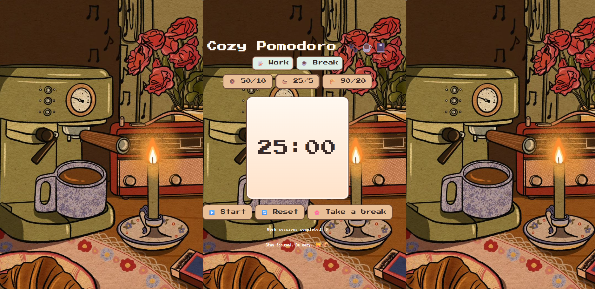

# Cozy Pomodoro

A cozy, coffee shop–themed Pomodoro timer with pixel‑art vibes. Choose a focus/break preset, press Start, and stay in the flow with soft ambient music and gentle session chimes.

## How it works

- Select a preset under the title:
  - 50 minutes Work → 10 minutes Break
  - 25 minutes Work → 5 minutes Break
  - 90 minutes Work → 20 minutes Break
- Click Start. The timer begins counting down.
- When a session ends, you’ll hear a chime and the phase toggles automatically (Work ↔ Break).

## Controls

- Start/Pause: toggles the timer and music
- Reset: stops the timer, rewinds the clock and music
- Take a break: immediately switch Work ↔ Break

Keyboard ideas (optional to implement later):

- Space: Start/Pause
- R: Reset
- S: Take a break
- 1/2/3: Choose preset (50/10, 25/5, 90/20)

## How it looks



## Project structure

```
cozy-pomodoro/
  public/
  src/
    assets/
    App.jsx
    App.css
    index.css
    main.jsx
```

## License

MIT © 2025 Rimjhim Singh
